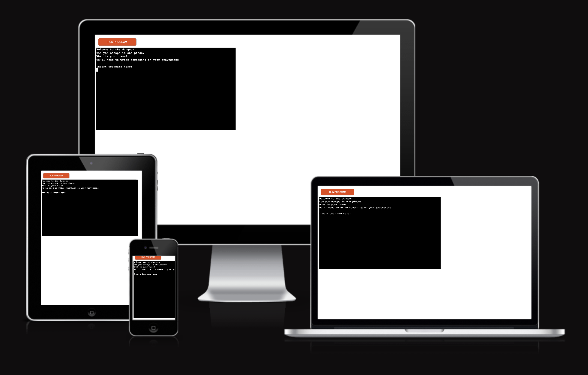
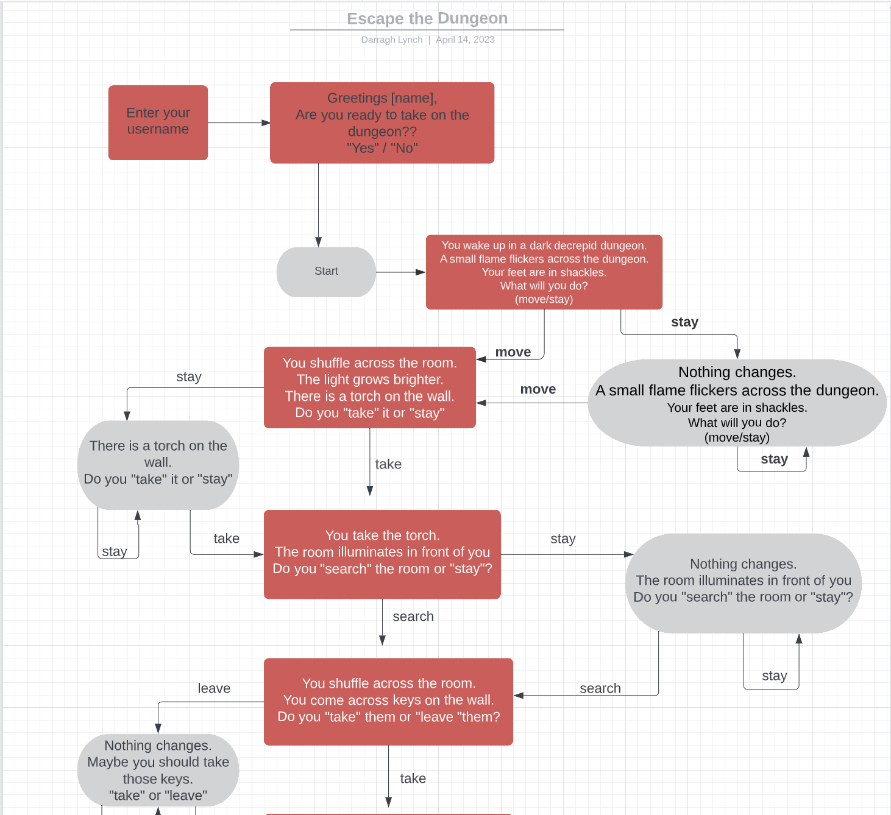
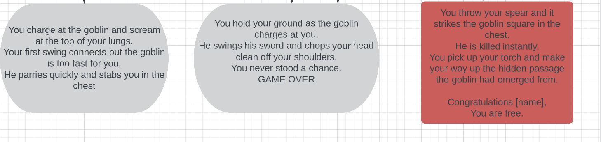

# Escape the Dungeon

Escape the dungeon is a text based adventure game designed to enthral and delight users. The game follows our heroes adventure as they awake in a dungeon and must follow the correct route to escape in one piece. Our hero will face approximately 10 decisions and only 1 path will take them to the exit. Our hero will need to explore the dungeon using a torch, find a set of keys to undo their shackles, find a wooden chest, select the correct weapon and then slay their captor in order to escape safely. This game is designed for users of all ages and is aimed to be completed within 10 minutes making it a quick and easy game that will keep players coming back for more

[Live Website](https://escape-the-dungeon.herokuapp.com/)

## User Goals and Stories

### User goals
- As a user I want to
  - easily and intuitively navigate throughout the website
  - browse the website naturally and with ease
  - understand how to play the game using simple instructions
  - be able to view the website and read all information on all screen sizes
  - easily input my information and play the game

### Business owner goals
- As the website business owner I want to 
  - provide an enjoyable gameplay experience for players.
  - have multiple gameplay options to encourage players to return.
  - provide a bug free gameplay experience.
  - have a logical gameplay story

### User Stories

#### As a user
  - As a user I want to visit the website to play the game
  - As a user I want to easily understand how to use the website
  - As a user I want to input my information with ease
  - As a user I want to play the game with ease
  - As a user I want to have an enjoyable experience
  - As a user I want to return to the site to play the game again

#### As a website business owner
- As a site owner I want to excite users and peak their interest
- As a site owner I want to allow for a good user experience
- As a site owner I want to allow the user to easily navigate the website without issues
- As a site owner I want to encourage users to play the game and potentially inform new users of their experience.

#### As a new user
- As a new user I want to navigate the page intuitively and with ease
- As a new user I want to understand the page purpose upon first viewing
- As a new user I want to have the instructions explained clearly on how to use the tool
- As a new user I want to easily input my choices
- As a new user I want to easily follow the storyline
- As a new user I want to enjoy the experience and return to play the game again

## Design

### Font
The design of this website is a very simple style as the format template was provided by the code institute. This program predominantly focuses on the Python programming language so does not incorporate CSS or styling features.

### Structure

This website has a simple single page design. This format was easiest as the template was provided by the Code institute.

### Design flow chart

This game flow and logic was designed using lucidchart. This was the first time using lucidchart so the chart is quite basic as it was made during the original genesis of the game. The game has since grown in size and stature and more text has been added to bulk up the options.

##### Main Page

## Technologies used
- Python
  - The main language used in this project was python
- HTML
  - The website contains a little bit of HTML
- CSS
  - The templates used from CI include some CSS
- GitHub
  - The website is hosted on GitHub
- GitPod
  - The website was developed on GitPod
- Git 
  - used to commit and push code during development
- Heroku
 - The game is hosted on heroku
- Convertio.co
  - [This](https://convertio.co/) site was used to convert jpg and png files to webp files
- LucidChart
 -The gameplay flow chart was designed on lucid chart

## Features 

### Existing Features

- __Header__

  - This section clearly shows the  company logo allowing users to instantly recognise the brand. The header also includes a title clearly displaying that the website is a "Pay calculator"

- __Instructions section__

  - The instuctions section includes four very simple steps for users to follow in order to use the tool.
  - This section is very easy to follow and allows users to use the tool with minimal effort on their end.

- __Hours worked section__

  - The hours worked section contains the names of the weekdays and corresponding input boxes.
  - The input boxes take number inputs and have a maximum of 8 hours. This is due to casual contract workers not being allowed to work more than 8 hours per day.
  - The hours are stepped in 0.5 intervals as this is how pay is calculated.

- __Commission and Tax section__

  - This section will allow the user to input the total amount of commission earned.
  - This figure will then be taken into multiple formulas and used to calculate commission per hour and the commission bonuses.
  - The tax section contains a simple checkbox. As most employees are on working holiday visas the box is automatically checked
  - The information gathered at this section will help to decide whether to base employees tax calculations off a 15% or a 35% tax bracket.

- __Pay breakdown section__

  - This section allows the user to view their over all pay and the precise breakdown of their pay.
  - This section shows how much the user made for working each day. Weekday pay is 29.23 per hour, Saturday pay is 35.07 and Sunday pay is 40.92 per hour. The user can then see the total pay per week.
  - The next section shows the users tax paid per week. This is calculated using a formula depending whether a user is on a working holiday visa or not.
  - The next section shows the user their total hours worked. User can also see their total commission made for the company.
  - The commission per hour section is then broken down by dividing commission by number of hours worked.
  - The bonus is calculated by using the formula that includes the different cph bands.
  - This bonus is then multiplied by the hours worked to calculate total bonus.
  - The total bonus is calculated by adding total weekly wage, deducting tax paid and adding the bonus.

  

 
- __Error 404 Page__
    - This page will help the user navigate back to the home page if there is any typo or broken links in the site. This page will contain a clickable link to return home.

### Features Left to Implement

- I would like to format the server in the future to accept form submissions and allow the site owner to view users form submissions.

- I would like to implement a feature that will calculate the tax due for local residents as opposed to working holiday makers. This would require the assistance of subject matter experts to advise on the correct taxation brackets. I will look at adding this feature in a future release.

## Testing 

### BUGS
 - I encountered several bugs while creating this project.

- I encountered a lot of difficulty when creating functions during this project. Having just come from learning JS I was having lots of issues with correct function formatting.

- I faced issues with timing of the text. The print statement within the functions were all executing at the same time and were creating issues. This was fixed using a time.sleep() code section.

- I faced a lot of issues with using If Else statements and opted instead to use smaller functions such as the fin() and validation() functions as this allowed me to reuse code where possible.

### User Testing

The site was tested on chrome, safari and opera browsers on desktop without any issues. The site was tested on desktop, tablet and mobile using chrome developer tools. The actual tablet testing was done on an ipad. The mobile testing was done on an iphone 12 using the safari browser and also tested on android devices OnePlus 7 and OnePlus Nord CE on chrome browsers. The site was also tested on a samsung phone using the opera browser. None of the tablet or mobile devices presented any issues.

### Validator Testing 

- HTML
  - No errors were returned when passing through the official [W3C validator](https://validator.w3.org/nu/?doc=https%3A%2F%2Fd-lynch95.github.io%2FPortfolio2_CPH-calculator%2F)
  

  
  -
- CSS
  - No errors were found when passing through the official [Jigsaw validator](https://jigsaw.w3.org/css-validator/validator?uri=https%3A%2F%2Fd-lynch95.github.io%2FPortfolio2_CPH-calculator%2F&profile=css3svg&usermedium=all&warning=1&vextwarning=&lang=en)
  

- Python
  - 

### Manual Testing

#### Functional Testing 

We first tested the input box to see if the values were recognised and input correctly.

| Input Box        |   PASS/FAIL   |
| -----------      | -----------   |
| Monday           |  PASS         |
| Tuesday          |  PASS         |
| Wednesday        |  PASS         |
| Thursday         |  PASS         |
| Friday.          | Pass          |
| Saturday.        | Pass          |
| Sunday.          | Pass          |

All of these input boxes worked as expected and accepted the values without any issues.

The commission made inout box was also tested and this did not present any issues.

The checkbox was also tested on multiple devices and this did not present any issues. At the moment the box is automatically checked as the majority of employees are on working holiday visas however as more local employees come aboard we will look to add functionality to account for tax residents and the tax brackets they fall into.

We tested the two buttons on the index page. The calculate now button calls the calculateAll function. This worked without any errors.

On the 404 page we tested the clickable link in the text. This link on the 404 page then took us back to the homepage.

We ran a lot of tests on the different formulas. These tests are outlined in the below table.

### Unfixed Bugs
 - There are no current bugs that we're aware of.

## Deployment

- The site was deployed to GitHub pages. The steps to deploy are as follows: 
  - In the GitHub repository, navigate to the Settings tab 
  - From the source section drop-down menu, select the Main Branch
  - Once the main branch has been selected, the page will be automatically refreshed with a detailed ribbon display to indicate the successful deployment. 

The live link can be found here - https://escape-the-dungeon.herokuapp.com/

- Clone the Repository Code Locally
  - Navigate to the GitHub Repository you want to clone to use locally:

  - Click on the code drop down button
  - Click on HTTPS
  - Copy the repository link to the clipboard
  - Open your IDE of choice (git must be installed for the next steps)
  - Type git clone copied-git-url into the IDE terminal
  - The project will now of been cloned on your local machine for use.

- Heroku 
  - The project was deployed using Code Institutes mock terminal for Heroku

  - Deployment steps:

    - Fork or clone this repository.

    - Ensure the Profile is in place.

    - requirements.txt can be left empty as this project does not use any external libraries

    - Create a new app in Heroku

    - Select "New" and "Create new app"

    - Name the new app and click "Create new app"

    - In "Settings" select "BuildPack" and select Python and Node.js. (Python must be at the top of the list)

    - Whilst still in "Settings", click "Reveal Config Vars" and input the folloing. KEY: PORT, VALUE: 8000. Nothing else is needed here as this project does not have any sensitive files

    - Click on "Deploy" and select your deploy method and repository

    - Click "Connect" on selected repository.

    - Either choose "Enable Automatic Deploys" or "Deploy Branch" in the manual deploy section

    - Heroku will now deploy the site

## Credits 

### Content 

- The format and template for the README file was borrowed from the [Code institute](https://codeinstitute.net/ie/).

- The image conversions from jpg to webp were done with [Convertio](https://convertio.co)

### Coding help

- The outline template for the Python was provided by the [Code Institiute](https://www.codeinstitute.com)

- A lot of the python coding was done with help from the tutorial pages at [w3schools](https://www.w3schools.com/)

- The tutor support team from codeinstitute were extremely helpful in helping me to overcome bugs in my code.

- I used countless stack overflow entries to help me to solve minor python related bugs.

- I used the following projects as inspiration for my project. [Zombie Survival](https://github.com/JamesFahey/zombie-survival/blob/main/run.py)

- Advice for creating global variables was taken from [Stack Overflow](https://stackoverflow.com/questions/50433604/how-do-i-store-an-input-as-a-global-variable)

- I used the following Youtube tutorials [Choose your own Adventure](https://www.youtube.com/watch?v=DEcFCn2ubSg) and [Time unravelled](https://www.youtube.com/watch?v=ypNFNr72Xe8&t=2411s) to help create my project

 - I also received help from the following slack users for minor bugs or style changes inc21, Tatiana Ruffo, Dave T, Jo_ci and I received a lot of help and advice from my mentor Gareth McGirr and from Paul Thomas our cohort leader.
