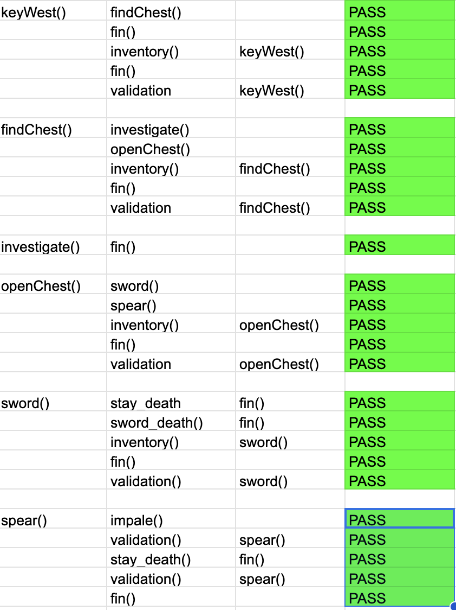

# Escape the Dungeon

Escape the dungeon is a text based adventure game designed to enthral and delight users. The game follows our heroes adventure as they awake in a dungeon and must follow the correct route to escape in one piece. Our hero will face approximately 10 decisions and only 1 path will take them to the exit. Our hero will need to explore the dungeon using a torch, find a set of keys to undo their shackles, find a wooden chest, select the correct weapon and then slay their captor in order to escape safely. This game is designed for users of all ages and is aimed to be completed within 10 minutes making it a quick and easy game that will keep players coming back for more

[Live Website](https://escape-the-dungeon.herokuapp.com/)

## User Goals and Stories

### User goals
- As a user I want to
  - easily and intuitively navigate throughout the website
  - browse the website naturally and with ease
  - understand how to play the game using simple instructions
  - be able to view the website and read all information on all screen sizes
  - easily input my information and play the game

### Business owner goals
- As the website business owner I want to 
  - provide an enjoyable gameplay experience for players.
  - have multiple gameplay options to encourage players to return.
  - provide a bug free gameplay experience.
  - have a logical gameplay story

### User Stories

#### As a user
  - As a user I want to visit the website to play the game
  - As a user I want to easily understand how to use the website
  - As a user I want to input my information with ease
  - As a user I want to play the game with ease
  - As a user I want to have an enjoyable experience
  - As a user I want to return to the site to play the game again

#### As a website business owner
- As a site owner I want to excite users and peak their interest
- As a site owner I want to allow for a good user experience
- As a site owner I want to allow the user to easily navigate the website without issues
- As a site owner I want to encourage users to play the game and potentially inform new users of their experience.

#### As a new user
- As a new user I want to navigate the page intuitively and with ease
- As a new user I want to understand the page purpose upon first viewing
- As a new user I want to have the instructions explained clearly on how to use the tool
- As a new user I want to easily input my choices
- As a new user I want to easily follow the storyline
- As a new user I want to enjoy the experience and return to play the game again

## Design

### Font
The design of this website is a very simple style as the format template was provided by the code institute. This program predominantly focuses on the Python programming language so does not incorporate CSS or styling features. The code uses minimal colour as an homage to the original text-based adventure games. The only colour in the game is red text showing "Game Over" when the player loses the game. The game also uses ASCII text showing "Escape the dungeon" when the player starts the game

### Structure

This website has a simple single page design. This format was easiest as the template was provided by the Code institute.

### Design flow chart

This game flow and logic was designed using lucidchart. This was the first time using lucidchart so the chart is quite basic as it was made during the original genesis of the game. The game has since grown in size and stature and more text has been added to bulk up the options.

##### Main Page

## Technologies used
- Python
  - The main language used in this project was python
- HTML
  - The website contains a little bit of HTML
- CSS
  - The templates used from CI include some CSS
- GitHub
  - The website is hosted on GitHub
- GitPod
  - The website was developed on GitPod
- Git 
  - used to commit and push code during development
- Heroku
 - The game is hosted on heroku
- Convertio.co
  - [This](https://convertio.co/) site was used to convert jpg and png files to webp files
- LucidChart
 -The gameplay flow chart was designed on lucid chart

## Features 

### Existing Features

- __Title Graphic__

  - This graphic uses ascii text to create a large graphic that shows the game title "Escape The Dungeon". This graphic adds to the user experience and adds more flair than a simple text based game.

- __External Libraries__

  - This project used several external libraries
  - We imported the time and os modules, we also imported colorama and pyfiglet.
  
  

- __List__

  - This program includes a list which players use as an inventory
  - As players pick up items during their journey they are added to the inventory
  - Players can easily cycle through their inventory using keyboard prompts

- __Input__

  - This game relies hevily on user input in order to progress the story.
  - This was added to the game using input boxes at each decision point

- __Functions__

  - This project reused a lot of sections of code. In order to save time and space functions were used heavily.
  - The main functions used regularly were fin() which allows the user to exit the game, validate() which validates user input and reprompts them if input is not valid and inventory() which allows the user to print the list containing their inventory items.
  
  
  

### Features Left to Implement

- I would like to add a typewriter effect to the game when I have more time to develop it.

- I would like to add more path directions to expand on the story.

- I would also like to add more options and more interactivity with the inventory items. The user currently has two keys remaining and I would like to add more options for these keys when time permits.

## Testing 

### BUGS
 - I encountered several bugs while creating this project.

- I encountered a lot of difficulty when creating functions during this project. Having just come from learning JS I was having lots of issues with correct function formatting. This was fixed using tutorials from w3 schools.

- I faced issues with timing of the text. The print statement within the functions were all executing at the same time and were creating issues. This was fixed using a time.sleep() code section.

- I faced a lot of issues with using If Else statements and opted instead to use smaller functions such as the fin() and validation() functions as this allowed me to reuse code where possible.

- I faced an issue with the heroku application freezing during run throughs. I opted to delete the application that I had previously made and redeploy it manually through heroku. 

- When using colorama all of the text was changing colour as opposed to just the text I had selected. This was corrected using the autoreset option.

### User Testing

The application was tested on a macbook air using the google chrome browser.

### Validator Testing 

- Python
  - No errors were found when passing through the [CI code linter](https://pep8ci.herokuapp.com/#)
  

### Manual Testing

#### Functional Testing 

I tested each of the pathways through the game individually to make sure there were no dead ends of any issues.
I ran through all of the functions and tested each option to record whether there were any issues. All of the functions passed the manual user testing and there were no issues with the code.

### Unfixed Bugs
 - There are no current bugs that we're aware of.

## Deployment

- The site was deployed to GitHub pages. The steps to deploy are as follows: 
  - In the GitHub repository, navigate to the Settings tab 
  - From the source section drop-down menu, select the Main Branch
  - Once the main branch has been selected, the page will be automatically refreshed with a detailed ribbon display to indicate the successful deployment. 

The live link can be found here - https://escape-the-dungeon.herokuapp.com/

- Clone the Repository Code Locally
  - Navigate to the GitHub Repository you want to clone to use locally:

  - Click on the code drop down button
  - Click on HTTPS
  - Copy the repository link to the clipboard
  - Open your IDE of choice (git must be installed for the next steps)
  - Type git clone copied-git-url into the IDE terminal
  - The project will now of been cloned on your local machine for use.

- Heroku 
  - The project was deployed using Code Institutes mock terminal for Heroku

  - Deployment steps:

    - Fork or clone this repository.

    - Ensure the Profile is in place.

    - requirements.txt can be left empty as this project does not use any external libraries

    - Create a new app in Heroku

    - Select "New" and "Create new app"

    - Name the new app and click "Create new app"

    - In "Settings" select "BuildPack" and select Python and Node.js. (Python must be at the top of the list)

    - Whilst still in "Settings", click "Reveal Config Vars" and input the folloing. KEY: PORT, VALUE: 8000. Nothing else is needed here as this project does not have any sensitive files

    - Click on "Deploy" and select your deploy method and repository

    - Click "Connect" on selected repository.

    - Either choose "Enable Automatic Deploys" or "Deploy Branch" in the manual deploy section

    - Heroku will now deploy the site

## Credits 

### Content 

- The format and template for the README file was borrowed from the [Code institute](https://codeinstitute.net/ie/).

- The image conversions from jpg to webp were done with [Convertio](https://convertio.co)

### Coding help

- The outline template for the Python was provided by the [Code Institiute](https://www.codeinstitute.com)

- I also took a lot of inspiration from the Code institute LoveSandwiches Walk through [Code Institiute](https://www.codeinstitute.com)

- A lot of the python coding was done with help from the tutorial pages at [w3schools](https://www.w3schools.com/)

- The tutor support team from codeinstitute were extremely helpful in helping me to overcome bugs in my code.

- The advice on pyfiglet installation came from [CodeSnail](https://www.codesnail.com/text-to-ascii-art-using-python/)

- I used the following youtube video for help with colorama installation [Youtube](https://www.google.com/search?q=how+to+use+colorama+in+python&rlz=1C5CHFA_enTH1020IE1025&oq=how+to+use+colorama+in+python&aqs=chrome..69i57j0i390i650l3.6370j0j4&sourceid=chrome&ie=UTF-8#kpvalbx=_KjQ_ZO-dAry9juMP5_qe4AI_32)

- I used countless stack overflow entries to help me to solve minor python related bugs.

- I used the following projects as inspiration for my project. [Zombie Survival](https://github.com/JamesFahey/zombie-survival/blob/main/run.py)

- I used the following tutorial for help with my requirements.txt file [LearnPython](https://learnpython.com/blog/python-requirements-file/)

- Advice for creating global variables was taken from [Stack Overflow](https://stackoverflow.com/questions/50433604/how-do-i-store-an-input-as-a-global-variable)

- I used the following Youtube tutorials [Choose your own Adventure](https://www.youtube.com/watch?v=DEcFCn2ubSg) and [Time unravelled](https://www.youtube.com/watch?v=ypNFNr72Xe8&t=2411s) to help create my project

 - I also received help from the following slack users for minor bugs or style changes inc21, Tatiana Ruffo, Dave T, Laura, Jo_ci and I received a lot of help and advice from my mentor Gareth McGirr and from Paul Thomas our cohort leader.
