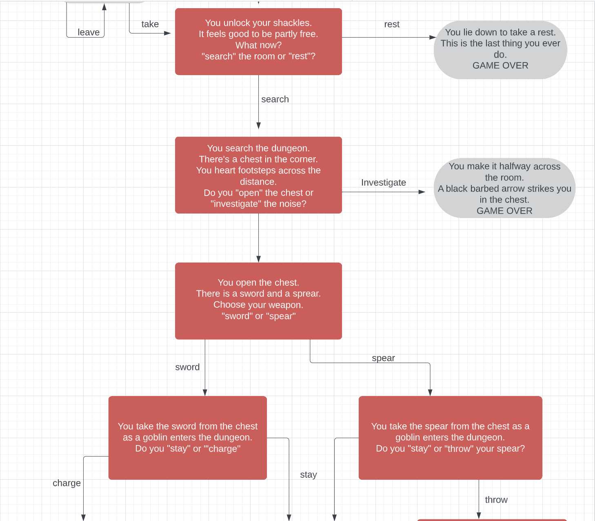

Welcome d-lynch95,

This is the Code Institute student template for deploying your third portfolio project, the Python command-line project. The last update to this file was: **August 17, 2021**

## Reminders

* Your code must be placed in the `run.py` file
* Your dependencies must be placed in the `requirements.txt` file
* Do not edit any of the other files or your code may not deploy properly

## Creating the Heroku app

When you create the app, you will need to add two buildpacks from the _Settings_ tab. The ordering is as follows:

1. `heroku/python`
2. `heroku/nodejs`

You must then create a _Config Var_ called `PORT`. Set this to `8000`

If you have credentials, such as in the Love Sandwiches project, you must create another _Config Var_ called `CREDS` and paste the JSON into the value field.

Connect your GitHub repository and deploy as normal.

## Constraints

The deployment terminal is set to 80 columns by 24 rows. That means that each line of text needs to be 80 characters or less otherwise it will be wrapped onto a second line.

-----
Happy coding!

# Portfolio2_CPH-calculator

The CPH calculator is an interactive online tool to help employees of HappyTravels to calculate their Commission Per Hour. This tool will be used to save employees time when calculating the Commission bonus structures and also allow employees to double check that their paychecks are correct each week. This is a very simple tool that works by accepting user inputs of hours worked and total commission earned. The tool also factors in the 15% tax bracket for working holiday makers. The tool then outputs total pay, pay per hour, commisson per hour, commission bonus and tax paid to allow users to understand their precise pay breakdown.

[Live Website](https://d-lynch95.github.io/Portfolio2_CPH-calculator/)

## User Goals and Stories

### User goals
- As a user I want to
  - easily and intuitively navigate throughout the website
  - browse the website naturally and with ease
  - understand how to use the website using simple instructions
  - be able to view the website and read all information on all screen sizes
  - easily input my information and view my pay 

### Business owner goals
- As the website business owner I want to 
  - provide a tool for employees to see their commission bonus
  - provide a way for employees to double check their pay is correct
  - provide a tool to free up employee time and increase efficiency
  - provide a way for employees to view current bonus status 
  - motivate employees to make more sales by viewing cph bonuses

### User Stories

#### As a user
  - As a user I want to visit the website to calculate my pay
  - As a user I want to easily understand how to use the website
  - As a user I want to input my information with ease
  - As a user I want to view my pay breakdown with ease
  - As a user I want to use the tool to ensure my weekly pay is correct
  - As a user I want to use the tool to calculate money needed to reach the next bonus 

#### As a website business owner
- As a site owner I want to provide a tool to allow employees to calcualate commission bonus
- As a site owner I want to excite users and peak their interest
- As a site owner I want to allow for a good user experience
- As a site owner I want to allow the customer to easily navigate the website without issues
- As a site owner I want to provide an error 404 page with a link home incase of any issues
- As a site owner I want to motivate employees to increase sales by allowing them to see commission structure
- As a site owner I want to increase transparency of pay between management and staff
- As a site owner I want to allow employees to independently calculate their wages

#### As a new user
- As a new user I want to navigate the page intuitively and with ease
- As a new user I want to understand the page purpose upon first viewing
- As a new user I want to have the instructions explained clearly on how to use the tool
- As a new user I want to easily input my information
- As a new user I want to view output of calculations with ease
- As a new user I want to have view my total pay package
- As a new user I want to have my pay breakdown explained to me
- As a new user I want to view the amount of taxation due
- As a new user I want to view my total bonus paid each week
- As a new user I want to enjoy the experience and return to use the tool each week

## Design

### Font
The design of this website is based off a very minimalist style. The purpose of this website is to provide a tool for users to calculate their weekly pay with ease. The design of the website focuses on usability and ease of understanding instead of complex design. The orange colour scheme is in-line with the HappyTravels brand and the main page title is written in a Lillita one font to reflect the fun and playful font of the HappyTravels logo. The main body is written in an Open Sans font to allow for accessibility and ease of reading. The font for the main body is white to allow for contrast and ease of reading. This font colour is also in line with brand guidelines.

### Structure

This website has a simple single page design. This format was easiest and allows the user to understand the information input process and use the tool instantaneously. The page also has a 404 error page to deal with any errors and allow the users to return to the main page.

### Wireframe

The wireframes were developed in a mobile first environment. The original wireframe design has had some minor alterations during production but has mostly remained true to the design. 

##### Main Page

## Technologies used
- HTML
  - The main body of the website was created using HTML
- CSS
  - The website was styled using a linked CSS file
- GitHub
  - The website is hosted on GitHub
- GitPod
  - The website was developed on GitPod
- Git 
  - used to commit and push code during development
- Convertio.co
  - [This](https://convertio.co/) site was used to convert jpg and png files to webp files
- Tinypng
  - [TinyPNG](https://tinypng.com/) was used to reduce file sizes across the site
- Favicon.io 
  - This site was used to create the [favicon](https://favicon.io/) files
- Balsamiq
  - The original wireframe idea was created using [Balsamiq](https://balsamiq.com/wireframes/desktop/#)

## Features 

### Existing Features

- __Header__

  - This section clearly shows the  company logo allowing users to instantly recognise the brand. The header also includes a title clearly displaying that the website is a "Pay calculator"

- __Instructions section__

  - The instuctions section includes four very simple steps for users to follow in order to use the tool.
  - This section is very easy to follow and allows users to use the tool with minimal effort on their end.

- __Hours worked section__

  - The hours worked section contains the names of the weekdays and corresponding input boxes.
  - The input boxes take number inputs and have a maximum of 8 hours. This is due to casual contract workers not being allowed to work more than 8 hours per day.
  - The hours are stepped in 0.5 intervals as this is how pay is calculated.

- __Commission and Tax section__

  - This section will allow the user to input the total amount of commission earned.
  - This figure will then be taken into multiple formulas and used to calculate commission per hour and the commission bonuses.
  - The tax section contains a simple checkbox. As most employees are on working holiday visas the box is automatically checked
  - The information gathered at this section will help to decide whether to base employees tax calculations off a 15% or a 35% tax bracket.

- __Pay breakdown section__

  - This section allows the user to view their over all pay and the precise breakdown of their pay.
  - This section shows how much the user made for working each day. Weekday pay is 29.23 per hour, Saturday pay is 35.07 and Sunday pay is 40.92 per hour. The user can then see the total pay per week.
  - The next section shows the users tax paid per week. This is calculated using a formula depending whether a user is on a working holiday visa or not.
  - The next section shows the user their total hours worked. User can also see their total commission made for the company.
  - The commission per hour section is then broken down by dividing commission by number of hours worked.
  - The bonus is calculated by using the formula that includes the different cph bands.
  - This bonus is then multiplied by the hours worked to calculate total bonus.
  - The total bonus is calculated by adding total weekly wage, deducting tax paid and adding the bonus.

  

 
- __Error 404 Page__
    - This page will help the user navigate back to the home page if there is any typo or broken links in the site. This page will contain a clickable link to return home.

### Features Left to Implement

- I would like to format the server in the future to accept form submissions and allow the site owner to view users form submissions.

- I would like to implement a feature that will calculate the tax due for local residents as opposed to working holiday makers. This would require the assistance of subject matter experts to advise on the correct taxation brackets. I will look at adding this feature in a future release.

## Testing 

### BUGS
 - I encountered several bugs while creating this project.

- I encountered a lot of difficulty when nesting the formulas within the calculateAll() formula. I did not realise that the child functions would have to be called seperately within the parent function after they had been declared.

- I faced issues with timing of the funcions. The functions were all executing at the same time and were creating issues. This was fixed using a selfTimeout code section.

- There was a lot of bugs faced when outputting the results of formulas and I had to convert all of the data types using parseFloat() to ensure the data could be used for other calculations.

- I had originally added a switch statement to calculate the commission per hour bonus however this would not run and was causing issues with other sections of my code. In the end I opted to remove this and instead use an if else statement.

- I was receiving a lot of NaN errors when running the calculateAll function. This error was somehow being caused as the code was contained within details and summary tags. I removed the tags and the code started working correctly.

- I faced a lot of contrast errors when checking accessibility. The original font was white on an orange background. Instead I opted for black text on the orange background.

### User Testing

The site was tested on chrome, safari and opera browsers on desktop without any issues. The site was tested on desktop, tablet and mobile using chrome developer tools. The actual tablet testing was done on an ipad. The mobile testing was done on an iphone 12 using the safari browser and also tested on android devices OnePlus 7 and OnePlus Nord CE on chrome browsers. The site was also tested on a samsung phone using the opera browser. None of the tablet or mobile devices presented any issues.

### Accessibility

- Home page

### Validator Testing 

- HTML
  - No errors were returned when passing through the official [W3C validator](https://validator.w3.org/nu/?doc=https%3A%2F%2Fd-lynch95.github.io%2FPortfolio2_CPH-calculator%2F)
  

  
  -
- CSS
  - No errors were found when passing through the official [Jigsaw validator](https://jigsaw.w3.org/css-validator/validator?uri=https%3A%2F%2Fd-lynch95.github.io%2FPortfolio2_CPH-calculator%2F&profile=css3svg&usermedium=all&warning=1&vextwarning=&lang=en)
  

### Manual Testing

#### Functional Testing 

We first tested the input box to see if the values were recognised and input correctly.

| Input Box        |   PASS/FAIL   |
| -----------      | -----------   |
| Monday           |  PASS         |
| Tuesday          |  PASS         |
| Wednesday        |  PASS         |
| Thursday         |  PASS         |
| Friday.          | Pass          |
| Saturday.        | Pass          |
| Sunday.          | Pass          |

All of these input boxes worked as expected and accepted the values without any issues.

The commission made inout box was also tested and this did not present any issues.

The checkbox was also tested on multiple devices and this did not present any issues. At the moment the box is automatically checked as the majority of employees are on working holiday visas however as more local employees come aboard we will look to add functionality to account for tax residents and the tax brackets they fall into.

We tested the two buttons on the index page. The calculate now button calls the calculateAll function. This worked without any errors.

On the 404 page we tested the clickable link in the text. This link on the 404 page then took us back to the homepage.

We ran a lot of tests on the different formulas. These tests are outlined in the below table.

### Unfixed Bugs
 - There are no current bugs that we're aware of.

## Deployment

- The site was deployed to GitHub pages. The steps to deploy are as follows: 
  - In the GitHub repository, navigate to the Settings tab 
  - From the source section drop-down menu, select the Main Branch
  - Once the main branch has been selected, the page will be automatically refreshed with a detailed ribbon display to indicate the successful deployment. 

The live link can be found here - https://d-lynch95.github.io/Portfolio2_CPH-calculator/

- Clone the Repository Code Locally
  - Navigate to the GitHub Repository you want to clone to use locally:

  - Click on the code drop down button
  - Click on HTTPS
  - Copy the repository link to the clipboard
  - Open your IDE of choice (git must be installed for the next steps)
  - Type git clone copied-git-url into the IDE terminal
  - The project will now of been cloned on your local machine for use.

## Credits 

### Content 

- The format and template for the README file was borrowed from the [Code institute](https://codeinstitute.net/ie/)

- The image conversions from jpg to webp were done with [Convertio](https://convertio.co)

- The image compressions were done using [Tinypng](https://tinypng.com)

- The fonts were taken from googlefonts.

- The logo was downloaded from Google images

- The Favicon was made using [Favicon](https://favicon.io/)

### Coding help

- The outline template for the HTML body was provided by the [Code Institiute](https://www.codeinstitute.com)

- A lot of the Javascript coding was done with help from the tutorial pages at [w3schools](https://www.w3schools.com/)

- Adding the Favicon to the website was done using help from [StackOverflow](https://stackoverflow.com/questions/4888377/how-to-add-a-browser-tab-icon-favicon-for-a-website)

- The tutor support team from codeinstitute were extremely helpful in helping me to overcome bugs in my code.

- I used countless stack overflow entries to help me to solve minor javascript related bugs.

- I used the following projects as inspiration for my project. [Loan Calculator](https://github.com/Code-Institute-Submissions/loancalculator) , [Viscocity Calculator](https://github.com/Code-Institute-Submissions/Viscosity-Calculator), [Calorie Calculator](https://github.com/Code-Institute-Submissions/calorie-calculator-1)

 - I also received help from the following slack users for minor bugs or style changes inc21, Tatiana Ruffo, Dave T, Jo_ci and I received a lot of help and advice from my mentor Gareth McGirr and from Paul Thomas our cohort leader.

- Advice for creating global variables was taken from [Stack Overflow](https://stackoverflow.com/questions/50433604/how-do-i-store-an-input-as-a-global-variable)